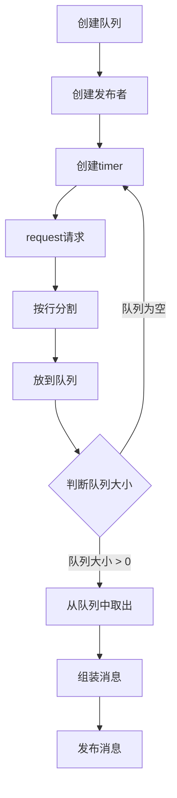

---
tags:
  - python
  - ROS2
---
⬅️ **上一节**：[2.5.3.1 多线程](2.5.3.1%20多线程.md)

> 📂 **配套代码**：[`333/topic_ws/src/demo_py_topic/demo_py_topic/novel_pub_node.py`](../../333/topic_ws/src/demo_py_topic/demo_py_topic/novel_pub_node.py)

# 注意事项
```python
class NovelPublisher(Node):
    def __init__(self, node_name):
        super().__init__(node_name)
        self.get_logger().info(f'{node_name} 启动.')
        self.novels_queue_ = Queue() # 创建一个队列对象，用于存储小说内容
        self.novel_publisher_ = self.create_publisher(String,'novel',10)
        self.create_timer(5.0, self.timer_callback)
        
    def timer_callback(self):
        if self.novels_queue_.qsize()>0:
            pass
```

> [!attention]
> 其中 `self.novels_queue_ = Queue() # 创建一个队列对象，用于存储小说内容`放到前面是因为后边callback会调用到队列，如果放到timer后面的话会出现调用时找不到`novels_queue_`但其实已经定义了
# 完整代码
```python
import rclpy
import requests
from rclpy.node import Node
from example_interfaces.msg import String
from queue import Queue


class NovelPublisher(Node):
    def __init__(self, node_name):
        super().__init__(node_name)
        self.get_logger().info(f'{node_name} 启动.')
        self.novels_queue_ = Queue() # 创建一个队列对象，用于存储小说内容
        self.novel_publisher_ = self.create_publisher(String,'novel',10)
        self.create_timer(5.0, self.timer_callback)


    def timer_callback(self):
        if self.novels_queue_.qsize()>0: # 判断队列大小
            line =self.novels_queue_.get() # 从队列中取出一行
            msg = String() # 组装消息
            msg.data = line
            self.novel_publisher_.publish(msg) # 发布
            self.get_logger().info(f'发布: {msg}')
        # self.novel_publisher_.publish()
        

    def download(self, url):
        response =requests.get(url) # 请求
        response.encoding = 'utf-8' 
        text = response.text
        # text.splitlines()
        self.get_logger().info(f'下载小说 {url},{len(text)}')
        for line in text.splitlines(): # 按行分割
            self.novels_queue_.put(line) #放到队列
        # response.text  # 获取网页内容


def main():
    rclpy.init()
    node = NovelPublisher('novel_pub')
    node.download('http://0.0.0.0:8000/novel1.txt')
    rclpy.spin(node)
    rclpy.shutdown()
```
# 整体实现逻辑

# 验证
## 验证topic存在
```bash
ros2 topic list
```
返回
```bash
/novel
/parameter_events
/rosout
```
## 验证topic是否正确发送
```bash
ros2 topic echo /novel
```
返回
```bash
data: 第一章 天下无敌
---
data: 第一章 天外来敌
---
data: 第三章 彻底无敌
---
```
## 验证topic发送频率
```bash
ros2 topic hz /novel
```
返回
```bash
s std dev: 2.49994s window: 2
average rate: 0.150
        min: 5.000s max: 10.000s std dev: 2.35696s window: 3
```

---

➡️ **下一节**：[3.2.2 订阅小说并合成语音](3.2.2%20订阅小说并合成语音.md)　·　📑 [返回笔记索引](../../README.md#笔记索引)
